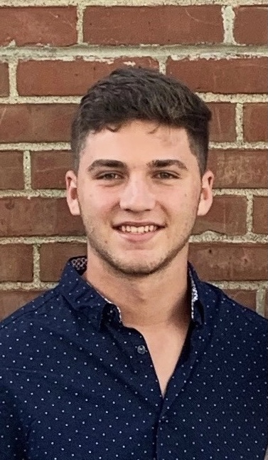
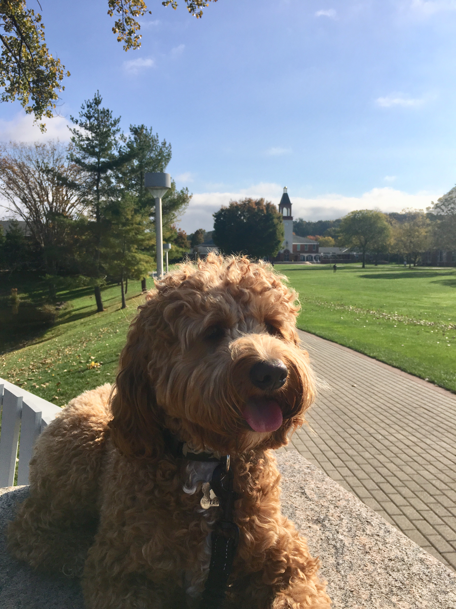

## About Me

Hello my name is Jacob Conrad! I am a freshman computer science major at Quinnipiac University in Hamden, CT. My fascination with computer science started in high school when I took three different programming classes and really enjoyed doing problem solving. Come time for college decisions Quinnipiac University was one of my top choices due to their highly regarded computer science program. This ultimately lead me to attend in Quinnipiac university in the fall of 2020. I can't wait to grow and do big things in the computer science field! More about me is that I have one dog, a cockapoo, and some of my favorite hobbies are playing sports like football, baseball, and basketball.

## Pages

[Home](./)

[Projects page](./projects)

## More about me

[Football Highlights](https://www.hudl.com/video/3/8292771/5de1d17e4deb1113b068a0ce) :dart:
